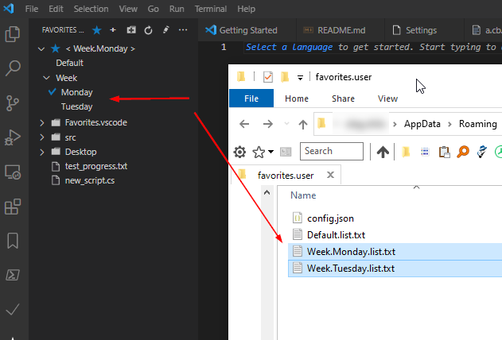
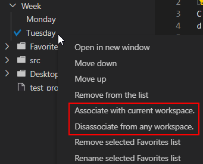

# Favorites - VSCode Extension

Manage and quickly access frequently used files, folders and favorites' lists.

https://vsmarketplacebadge.apphb.com/installs-short/oleg-shilo.favorites.svg

[](http://www.csscript.net/Donation.html)

## Overview

This simple extension allows adding, removing and managing documents in the globally maintained Favorites' list(s).

This extensions is similar to other plugins of the "Favorites" family. Though apart from traditional item context menu and buttons this plugin offers an extremely simple and intuitive way of structuring your favorites.

The items definition is just a text document that can be freely edited with the changes reflected in the VSCode panel automatically after saving the file.

Another distinction points are the ability to have both _file_ and _folder_ items as well as the ability to switch between multiple Favorites' lists. This is particularly useful for grouping favorite items according the problem domain into individual lists, which can be easily switched depending on the user activity.

## Key Features

The functionality is self explanatory and includes following features:

* The items can be either files or folders
* Support for custom/multiple favorites lists.
* Opening document or folder by clicking (or double-clicking) the item in the _Favorites_ list.
* Managing items and lists via the dedicated toolbar button or the node context menu.
* Refreshing (reloading) _Favorites_ via the dedicated toolbar button.
* Moving items up and down in the list
* Managing (editing) _Favorites_ list directly in _VSCode_. Once the _Favorites_ list definition is edited and saved the changes are automatically reflected in the _Favorites_ panel. Below is a sample of the _Favorites_ list definition.

### _Managing list items:_


### _Managing lists:_


## List definition rules

The item definition (in "&lt;name&gt;.list.txt") can contain environment variables, which  are extended at runtime into a full path:

```txt
$USERPROFILE\AppData\Roaming\Code\User\cs-script.user\new_script.cs
```

The definition syntax also allows comments - any line that starts with '#'.

And you can also use non-path text as an items' separator (e.g. `"-- Folders --"`).

The extension also allows showing Favorite folder item content.
This feature is not a substitution of the Workspace explorer view, which does by far superior job. It's just a convenience measure for a quick access of the top level folder files. The feature can be enabled/disabled with `favorites.showFolderFiles` setting.

You can group some lists that somewhat logically related. The groping is based on the naming convention: `[group_name.]<list_name>.list.txt`



There is another type of customization that helps managing excessive amount lists. Thus some lists can be workspace/folder specific. Meaning that if you have a workspace/folder is opened and some of the configured lists are marked as folder specific (associated with teh folder) then only these lits will be shown in the lists tree.

You can associate or disassociate a list by selecting the list selecting the desired action from the context (right-click) menu.



### _Experimental features_

From v1.5.3 you can use workspace local list `local.list.txt` in the workspace folder `<workspace>\.fav\`. This list can only be added, removed and edited manually.

This list can contain both absolute and relative paths. All relative paths are resolved at runtime against the workspace folder.
The simplest content of the `<workspace>\.fav\local.list.txt`:

```txt 
.\.fav\local.list.txt 
```


## Limitations

* _ShowFolderFiles_ feature overall experience is subject to the limitations/defects of the VSCode tree view. Thus TreeView node always triggers node selection when you try to expand it. This defect is officially reported and being dealt with by the VSCode team:<br/>
   https://github.com/Microsoft/vscode/issues/34130<br/>
   https://github.com/patrys/vscode-code-outline/issues/24<br/>

## Hints/Tips

* By default VSCode opens any file clicked from the  _Favorites_ list in the so called "preview mode". Thus the document tabs are reused and every new file is opened in the same tab. If you prefer to open a clicked _Favorites_ document in a new tab then you need to disable document the previewMode is the settings:
  1. Use _Command Palette_ to open your settings file ("Preferences: Open User Settings")
  2. Add the "workbench.editor.enablePreview" property, and set it's value to _false_.
  3. Use "favorites.singleListMode" to disable support for multiple lists and hide the `<Default>` tree view item as well as the whole list selection UI elements.
